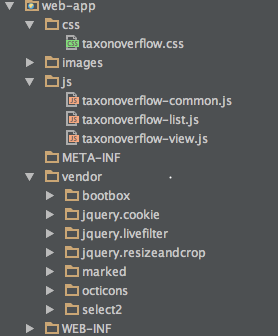
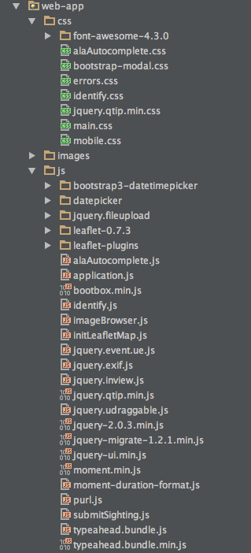

# Groovy and Grails guidelines

This guideline is meant to be a compilation of best practices, tips and gotchas.
## Detailed TOC
(Using [Atom markdown-toc plugin](https://atom.io/packages/markdown-toc))
<!-- TOC depth:6 withLinks:1 updateOnSave:1 orderedList:0 -->

- [Groovy and Grails guidelines](#groovy-and-grails-guidelines)
	- [Detailed TOC](#detailed-toc)
	- [Best Practices and Tips](#best-practices-and-tips)
		- [General](#general)
		- [BuildConfig.groovy](#buildconfiggroovy)
		- [Web static resources (Resource Plugin)](#web-static-resources-resource-plugin)
		- [External configuration](#external-configuration)
		- [Logging](#logging)
		- [Simple asychronous methods in Grails](#simple-asychronous-methods-in-grails)
		- [Other](#other)
	- [Version specific gotchas](#version-specific-gotchas)
	- [ALA shared plugins](#ala-shared-plugins)
<!-- /TOC -->

## Code Reviews
[See Code Style and Review Guidelines](codeReviews.md)

## Best Practices and Tips

### General
* Let's put [this guide](https://tedvinke.wordpress.com/2015/03/15/basic-groovy-and-grails-code-review-guidelines/) as the baseline <i class="fa fa-thumbs-up"></i>

* Don't check-in commented lines into your SCM. If you want to know what was there before, that is what SCM version history is for.

### BuildConfig.groovy
* For all Grails projects using version 2.x+, it is recommended to set the targeted compilation level to 1.7+. **By using 1.6 you would be introducing an unnecessary performance penalty to your app**. Just make sure you have this in your `BuildConfig.groovy`:
```groovy
grails.project.target.level = 1.7
grails.project.source.level = 1.7
```
<i class="fa fa-exclamation-triangle"></i> Note that you should be using a JDK 1.7.0_60 or bigger to avoid issues. More information [here](http://www.groovy-lang.org/indy.html).

* Since Grails 2.3+ **class auto-reloading is not enabled by default**. There are two options to enable it:
  1. Use the following option when running the app:
  ```bash
  grails run-app -reloading
  ```
  2. Add the following line to your `BuildConfig.groovy`:
  ```groovy
  grails.reload.enabled = true
  ```
* For Grails version 2.3+ (not 3.x), dependency management has to be done using Aether (Maven). Just add this if you don't already have it:
```groovy
grails.project.dependency.resolver = "maven"
```
* By default we should use the ALA Nexus repository to resolve all the dependecies:
```groovy
  grails.project.dependency.resolution = {
    ...
    repositories {
        mavenLocal()
        mavenRepo "http://nexus.ala.org.au/content/groups/public/"
    }
    ...
  }
```

### Web static resources (Resource Plugin)
* For Grails version 2.3+ (not 3.x), these are the recommended Resources plugin dependencies:
```groovy
    runtime ':resources:1.2.14'
    if (Environment.current == Environment.PRODUCTION) {
        runtime ":zipped-resources:1.0.1"
        runtime ":cached-resources:1.1"
        compile ":cache-headers:1.1.7"
        runtime ":yui-minify-resources:0.1.5"
    }
```

* In order to host the third party web libraries (eg: jQuery, Angular, ...), it is recommended to store them as they come inside its own folder within a common parent folder (eg: `/web-app/vendor` or `/web-app/3rdparty`), rather than trying to flatten them out and split them in the standard /js, /css,... standard Grails web-app folders.
To illustrate this better, next first image shows a better setup than the second image:

  

* To enable that setup the `/vendor` folder has to be added to the resources filter declaration in your `Config.groovy` file:
```groovy
// What URL patterns should be processed by the resources plugin
grails.resources.adhoc.patterns = ['/js/*', '/images/*', '/css/*', '/plugins/*', '/vendor/*']
grails.resources.adhoc.includes = ['/js/**', '/images/**', '/css/**','/plugins/**', '/vendor/**']
```

* Don't remove the plain (not minified) version from your web library. Those are the ones that should be declared in your Resources file as they enable debugging and they will get minified and gzipped in PROD thanks to the resources plugin declaration above <a href="#Web_static_resources_(Resource_Plugin)"><i class="fa fa-arrow-up"></i></a>

* It helps to keep the version number of your libraries in the containing folder if they don't come with it as part of their file name (eg: jquery-2.0.1.js vs bootbox.js). Or you can just create a folder with the version number you are using. Eg:
```
/vendor/bootbox-4.4.0/bootbox.js
```
or
```
/vendor/bootbox/4.4.0/bootbox.js
```

* Default Grails `/web-app/js` and `/web-app/css` folders are better used for resources that have been just developed exclusively for its host application.

* Resources that are declared inside a plugin need to specify the plugin name as part of the URL building process. Eg:
```groovy
modules = {
    ...
    bootstrap {
        dependsOn 'core'
        resource url: [ dir:'js', file: 'bootstrap.min.js', plugin:'ala-bootstrap3']
        resource url: [ dir:'css', file: 'bootstrap.min.css', plugin:'ala-bootstrap3']
    }
    ...
}
```

### External configuration
* We use `.properties` file for external config instead of `.groovy` due to CAS limitation.
* External config is usually located in the system folder: `/data/<app-name>/config/<app-name>.properties`
* External config is digested **after** processing the `Config.groovy` file. That means code like this inside it is useless:
```groovy
/******************************************************************************\
 *  EXTERNAL SERVERS
 \******************************************************************************/
if (!biocache.baseURL) {
    biocache.baseURL = "http://biocache.ala.org.au/"
}
if (!ala.baseURL) {
    ala.baseURL = "http://www.ala.org.au"
}
if (!headerAndFooter.baseURL) {
    headerAndFooter.baseURL = "http://www2.ala.org.au/commonui"
}
```
* In any case, all external services url references should be in the external config file.
* By default all external services url references should not have a trailing forward slash at the end. So we should have this:
```groovy
biocache.baseURL = "http://biocache.ala.org.au"
```
as opposed to this:
```groovy
biocache.baseURL = "http://biocache.ala.org.au/"
```
* REST services endpoints partial path references (without the host.) eg: `/ws/intersect/` should be in a `Constants.groovy` file instead of the external config file.

### Logging
* ALA logging recommended configuration in Config.groovy (not sure about this one actually):
```groovy
    def loggingDir = (System.getProperty('catalina.base') ? System.getProperty('catalina.base') + '/logs' : './logs')
    if(!(new File(loggingDir).exists())){
        loggingDir = "/tmp"
    }

    // log4j configuration
    log4j = {
        appenders {
            environments {
                production {
                    rollingFile name: "tomcatLog", maxFileSize: '1MB', file: "${loggingDir}/${appName}.log", threshold: org.apache.log4j.Level.ERROR, layout: pattern(conversionPattern: "%d %-5p [%c{1}] %m%n")
                }
                development {
                    console name: "stdout", layout: pattern(conversionPattern: "%d %-5p [%c{1}] %m%n"), threshold: org.apache.log4j.Level.DEBUG
                }
                test {
                    rollingFile name: "tomcatLog", maxFileSize: '1MB', file: "/tmp/${appName}", threshold: org.apache.log4j.Level.DEBUG, layout: pattern(conversionPattern: "%d %-5p [%c{1}] %m%n")
                }
            }
        }
        root {
        // change the root logger to my tomcatLog file
            error 'tomcatLog'
            warn 'tomcatLog'
            additivity = true
        }

        error   'au.org.ala.cas.client',
                'grails.spring.BeanBuilder',
                'grails.plugin.webxml',
                'grails.plugin.cache.web.filter',
                'grails.app.services.org.grails.plugin.resource',
                'grails.app.taglib.org.grails.plugin.resource',
                'grails.app.resourceMappers.org.grails.plugin.resource'

        debug   'grails.app'
    }
```

### Simple asychronous methods in Grails

1. Add the following to resources.groovy:
```groovy
    // required for @Async annotation support
    xmlns task:"http://www.springframework.org/schema/task"
    task.'annotation-driven'('proxy-target-class':true, 'mode':'proxy')
```
2. Annotate the method you want to make asynchronour with `@Async`
```groovy
import org.springframework.scheduling.annotation.Async
```

<i class="fa fa-exclamation-triangle"></i> GOTCHA:
By default, the RequestAttributes thread local used by Grails/Spring is not inheritable, so new threads will not have access to the request context when calling web services. This line works around this issue by resetting the request attributes with the inheritable flag set to true, meaning spawned threads will inherit the state.
Add this to the controller before the asynchronous method call:
```groovy
    RequestContextHolder.setRequestAttributes(RequestContextHolder.getRequestAttributes(), true)
```


### Other
* Several ALA projects have a service called `WebService` or WebserviceService` as means to create a custom REST client. It is recommended to use one of the existing ones instead of trying to reinvent the wheel. I'd recommend using the Groovy HTTPBuilder client: https://github.com/jgritman/httpbuilder

* Grails JSON null values parsing issue: All versions of Grails until 2.5.1 and 3.0.4 have a problem in the way the `grails.converters.JSON` parses `null` values. You can find the workaround for older versions of Grails [here](TODO)

## Version specific gotchas
* Grails 2.4.4 has a [critical bug](https://jira.grails.org/browse/GRAILS-11687) regarding the Hibernate flushing mechanism. Given that many of our apps use this version, it is recommended to move them to at least 2.4.5
* Grails 2.5.x do not run in non-forked mode in any of the existing IntellijIDEA releases to date (14.1.4 at the time of writing). It is been fixed for next release. More details [here](https://youtrack.jetbrains.com/issue/IDEA-138537).

## ALA shared plugins
There is a set of Grails plugins that are reused among our projects:

* __[ala-bootstrap3](https://github.com/AtlasOfLivingAustralia/ala-bootstrap3)__: provides a basic set of web resources to correctly apply the new 2015 ALA web theme based on bootstrap 3.4.x
* __[ala-bootstrap2](https://github.com/AtlasOfLivingAustralia/ala-bootstrap2)__: provides a basic set of web resources for the old ALA web theme based on bootstrap 2.3.x
* __[ala-auth](https://github.com/AtlasOfLivingAustralia/ala-auth-plugin)__: ALA authentication/authorization plugin interface to CAS.
* __[ala-ws-security](https://github.com/AtlasOfLivingAustralia/ala-ws-security-plugin)__: Web service specific security code, e.g. API Key filters
