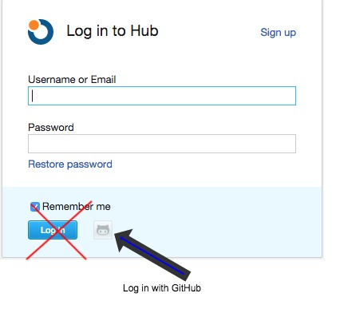

# Upsource Code Review Tool (Trial)

## URL

https://upsource.ala.org.au

This is currently using the default "Free for 10 users” licence. If we keep it, and need more than 10 users, then we’ll have to apply for the free OS licence. This is just a trial to see if it is better than GitHub’s pull requests.

## Log in

You can log in using your GitHub account (but you need to hit the little GitHub button instead of the login button).

## Creating a Review
1. Log into Upsource with your GitHub user
1. Find one of the revisions that you want to review (reviews in Upsource are based on individual commits, not Prs)
1. In the Review screen, click the Revisions tab on the right
1. Click Add Revision
1. Tick all the other revisions that you want reviewed

## Creating a project

1. Log into Upsource
1. Click the 'nut' icon (4th from the right)
1. Click 'Create project'
1. Enter a name and unique id
1. If your project covers multiple GitHub repos (e.g. a UI and a service repo), check "Project is hosted in multiple repositories"
  1. This will give you a button to add additional repositories. For each one, you need to specify a directory to serve as the project root.
1. Set VCS = Git
1. Repository URL = URL for your repo
1. Authentication method = Anonymous
1. Test connection
1. Build System = None
1. Leave everything else as the default

## Suggested dev process

1. Pull the ticket into In Progress and assign it to yourself
1. Create a new branch, following the [GitFlow](https://www.atlassian.com/git/tutorials/comparing-workflows/gitflow-workflow) process
1. Make your change
1. Commit & Push to GitHub
1. Create a PR
1. Merge the PR
1. Create a review in Upsource
1. Add the link to the review in a comment on the ticket
1. Move the ticket to QA
1. If you need to make changes based on review comments, add those revisions to the SAME review.
